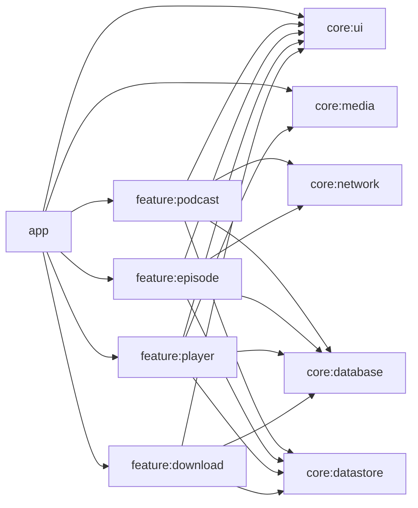

# Podcast App Architecture

## Goals
- Compose-first UI
- Modern Android architecture with clear boundaries
- Offline-first for subscriptions and episodes
- Background playback with Media3
- Easy-to-test domain logic

## App Shape
- Single-activity app
- Multi-screen Compose with Navigation
- MVVM + UDF (immutable UI state, explicit events)
- Clean Architecture layers

## Layers
- UI layer: Compose + ViewModel + UI state
- Domain layer: use cases + repository interfaces + entities
- Data layer: repository implementations + data sources

## Data Flow
- UI events -> ViewModel -> UseCase -> Repository -> Data sources
- Data sources update Room, which is the source of truth
- UI observes Room flows (mapped to UI state)

## Module Graph

## Key Responsibilities
- app
  - Navigation graph, DI entry points, permission handling, app theme
- core:ui
  - Theme, typography, reusable composables, loading/error/empty states
- core:network
  - RSS fetching, HTTP client, XML parsing
- core:database
  - Room entities, DAOs, DB config
- core:datastore
  - Preferences store (playback speed, auto-download, sort order)
- core:media
  - Media3 player wrapper, playback queue, media session
- feature:podcast
  - Subscription list, add/remove subscription
- feature:episode
  - Podcast detail, episodes list, episode search
- feature:player
  - Mini player, full player, transport controls
- feature:download
  - Download state, download list, retry/delete

## Source of Truth
- Subscriptions and episodes are persisted in Room
- RSS fetch updates Room, UI reads Room
- Preferences live in DataStore
- Player state comes from Media3 wrapper exposed as Flow

## Testing Targets
- Use cases: unit tests
- Repositories: data tests with fake sources
- ViewModels: state reducer tests
- UI: Compose UI tests for key screens
